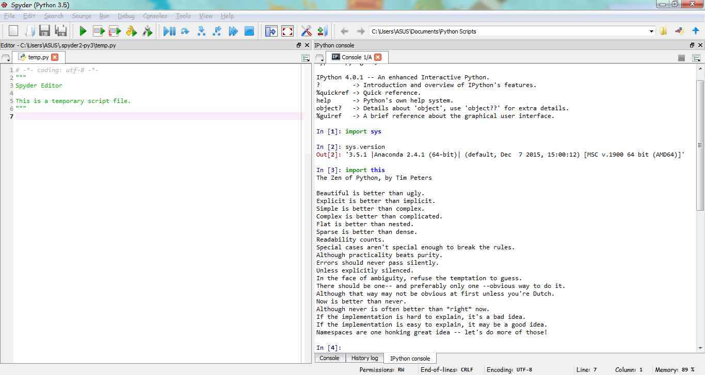

UECM3033 Assignment #1 Report
========================================================

- Prepared by: ONG YEE LENG
- Tutorial Group: T2

--------------------------------------------------------

## Task 1 -- setup a github repository

The reports, codes and supporting documents are uploaded to Github at: 

[https://github.com/yeeleng/UECM3033_assign1](https://github.com/yeeleng/UECM3033_assign1)

---------------------------------------------------------

## Task 2 -- setup python

Put here the screen shot of file (python.png)

------------------------------------------------------------

## Task 3 -- modify and run Python script

In this section, please report:

1. The hexadecimal value of your student ID.

    Hexadecimal representation of 1204756 is 0x126214.
    

2. Write down the definite integrals that you have chosen.

    $$\int_0^{\infty} sin{x^2} dx = \frac{\sqrt{2}\sqrt{\pi}}{4}.$$
    

3. Write down your system of 10 linear equations.

	\begin{align*}
    	3 x_0 + x_1 + 2 x_2 + 4 x_3 + 9 x_4 + 8 x_5 + x_6 + 5 x_7 + 2 x_9 &= 9,\\
	x_0 + 2 x_1 + 3 x_2 + 4 x_3 + 5 x_4 + 6 x_5 + 7 x_6 + 8 x_7 + 9 x_8 &= 8,\\
	2 x_0 + 3 x_1 + 4.5 x_2 + 5 x_3 + 6 x_4 + 7 x_5 + 8 x_6 + 9 x_7 &= 7,\\
	3 x_0 + 4 x_1 + 25 x_2 + 6 x_3 + 7 x_4 + 8 x_5 + 9 x_6 + x_7 + x_8 + 2.3 x_9 &= 6,\\
	4 x_0 + 5 x_1 + 6 x_2 + 7 x_3 + 8 x_4 + 9 x_5 + x_7 + 2 x_8 + 3 x_9 &= 5,\\
	5.5 x_0 + 6 x_1 + 7 x_2 + 8 x_3 + 9 x_4 + 20 x_5 + x_6 + 2 x_7 + 3 x_8 + 4 x_9 &= 4,\\
	6 x_0 + 7 x_1 + 8 x_2 + 9 x_3 + x_5 + 2 x_6 + 3 x_7 + 4 x_8 + 5 x_9 &= 3,\\
	7 x_0 + 8 x_1 + 9 x_2 + x_4 + 2 x_5 + 3 x_6 + 4 x_7 + 5 x_8 + 6 x_9 &= 2,\\
	8 x_0 + 9 x_1 + x_3 + 2 x_4 + 3 x_5 + 4 x_6 + 5 x_7 + 6 x_8 + 7 x_9 &= 1,\\
	9 x_0 + 10 x_1 + x_2 + 2 x_3 + 3 x_4 + 4 x_5 + 5 x_6 + 6 x_7 + 7 x_8 + 8 x_9 &= 5.
	\end{align*}

Here are the examples of how to add equations in markdown:

$$\int_0^{\infty} e^{-x^2} dx = \frac{\sqrt{\pi}}{2}.$$

\begin{align*}
3 x_0 +x_1 &= 9,\\
x_0 + 2 x_1 &= 8.
\end{align*}

-----------------------------------

last modified: 29/1/2016
